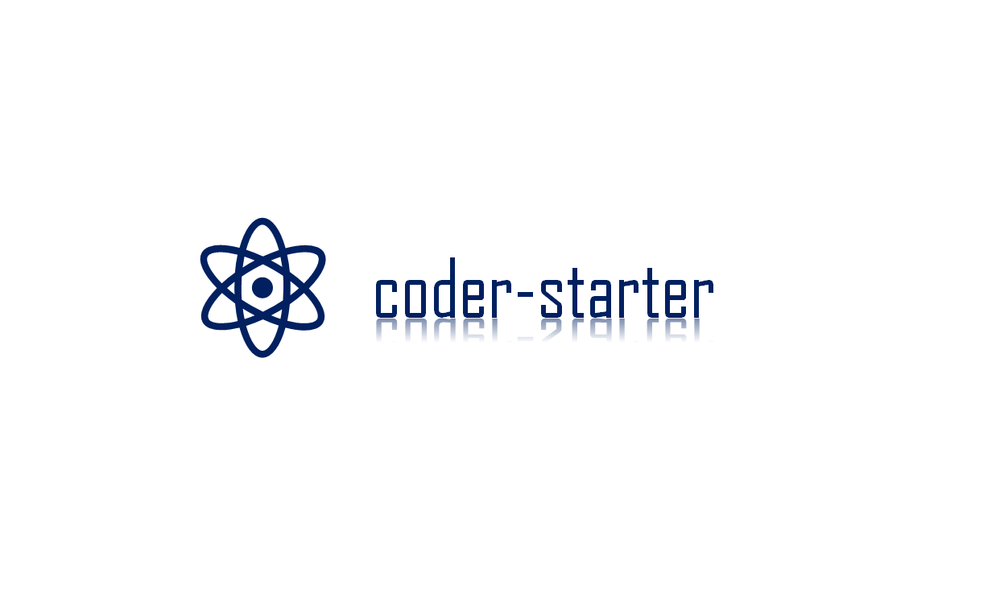

-----------------------------------------------------------------------
#### [学习路线知识图](https://www.processon.com/view/link/60e97db9e0b34d7b4e77db23)

##### Java集合

[ArrayList](https://mp.weixin.qq.com/s/NHJF-C2WpxPPWq0gkneinw)

##### JVM

[浅谈JVM垃圾回收机制](https://mp.weixin.qq.com/s/yUXr147U7NoQd6-crkVcDg)

[Java9-Java17新特性汇总](https://mp.weixin.qq.com/s/m-0KphNk2t6VzCbnc39-Lg)

##### Redis

[Redis数据结构--SDS](https://mp.weixin.qq.com/s/g60-GKB5C7XCLNyq5rvurQ)

[什么是缓存穿透、缓存击穿、缓存雪崩？解决方案？](https://mp.weixin.qq.com/s/ItbbHqsFPCf4EgYfHiw8KA)

[Redis持久化机制和实现原理](https://mp.weixin.qq.com/s/0h-eTqxIjXRR7iHylddGyw)

[Redis如何解决BigKey问题](https://mp.weixin.qq.com/s/fy9hjb11JTDeYrI85tyncQ)

##### SpringBoot

[Spring Boot通用mapper整合的方法及步骤](https://mp.weixin.qq.com/s/rx-oGXnaguc8OE49yJQYeg)

##### Elasticsearch

[Elasticsearch学习笔记](https://mp.weixin.qq.com/s/arREnrB_Bi5glRLX4mcuWQ)

##### Linux

[常用命令](https://mp.weixin.qq.com/s/shOF-mTjKijSPmY2ZeC1Fg)

