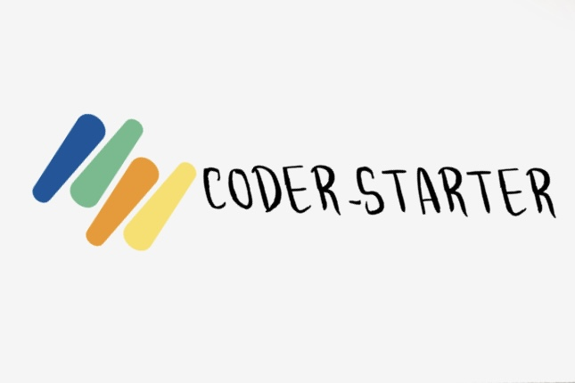

-----------------------------------------------------------------------
##### [学习路线](https://www.processon.com/view/link/60e97db9e0b34d7b4e77db23)

##### Java集合

[ArrayList](https://mp.weixin.qq.com/s/g60-GKB5C7XCLNyq5rvurQ)

##### JVM

[浅谈JVM垃圾回收机制](https://mp.weixin.qq.com/s/yUXr147U7NoQd6-crkVcDg)

##### Redis

[Redis数据结构--SDS](https://mp.weixin.qq.com/s/g60-GKB5C7XCLNyq5rvurQ)

##### SpringBoot

[Spring Boot通用mapper整合的方法及步骤](https://mp.weixin.qq.com/s/rx-oGXnaguc8OE49yJQYeg)

##### Elasticsearch

[Elasticsearch学习笔记](https://mp.weixin.qq.com/s/arREnrB_Bi5glRLX4mcuWQ)

##### Linux

[常用命令](https://mp.weixin.qq.com/s/shOF-mTjKijSPmY2ZeC1Fg)

